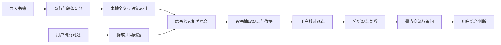

# 主题阅读技术实现

> 历史技术提议，不是现行架构说明。SQLite 主题表、向量索引、术语审核和五阶段观点整理属于方案设想；当前存储与检索边界见[0.1.9 说明](../releases/0.1.9.md)及源码。文中问题为设计示例，不是用户问答。

## 核心原则

技术流程必须先生成可核对的作者观点，再分析观点关系。不能让模型先决定“这里存在争议”，再回头寻找支持材料。



## 一、书籍入库

EPUB 导入后复用阅读器的解析能力，按章节、标题、段落和语义边界切成可定位原文。每个片段保存：

- `bookId`、书名和作者
- 章节名、章节序号
- EPUB CFI 或等价定位信息
- 原文文本、前后邻文
- 内容哈希和书籍版本

片段先进入本地全文索引。稳定版本再增加本地多语种向量索引，形成“关键词命中 + 语义相近”的混合检索；这样不依赖生成模型服务是否提供 embedding。

## 二、研究问题

用户创建主题时输入主问题和范围，例如：

> 一个人为什么会拖延？比较原因、维持机制与有效干预；暂不讨论临床诊断。

墨点建议少量共同问题，用户确认后才保存。这些问题会以相同方式询问每本书，避免对不同作者提出完全不同的问题后强行比较。

## 三、检索相关原文

系统按“共同问题 × 书籍”执行混合检索：

1. 全文索引召回包含关键词、同义词和作者原词的段落。
2. 语义索引召回文字不同但讨论同一概念的段落。
3. 重排器根据当前问题给候选段落排序。
4. 每本书保留少量高相关片段，并让用户查看和增删。

模型只接收候选片段，不发送整本书。检索不到时显示“这本书没有直接回答”，不能要求模型补出观点。

## 四、观点抽取

生成模型按固定结构逐书抽取，不直接写自然语言总结：

```ts
type Viewpoint = {
  id: string;
  questionId: string;
  bookId: string;
  claim: string;
  reasons: string[];
  scope: string;
  authorTerms: string[];
  passageIds: string[];
  status: 'draft' | 'confirmed' | 'rejected';
};
```

约束规则：

- `passageIds` 为空的观点不能展示为作者观点。
- `claim` 必须是原文可以支持的转述，不能加入外部知识。
- 模型不确定时返回“证据不足”，而不是提高措辞确定性。
- 用户点击“查看原文”可以回到具体章节和位置。

## 五、术语统一

系统先提取作者原词，再建议映射到用户研究使用的中立术语。映射关系保存为：

- `equivalent`：基本同义
- `overlapping`：部分重合
- `related`：有关联但不是同一概念
- `distinct`：必须区分
- `uncertain`：需要用户确认

界面始终保留作者原词。系统不能为了方便矩阵展示而把相近概念自动合并。

## 六、观点关系分析

只有观点得到用户确认后，墨点才比较关系。关系类型为：

```ts
type ViewpointRelation = {
  viewpointIds: string[];
  type: 'similar' | 'complementary' | 'different_scope' | 'conflicting' | 'unanswered';
  explanation: string;
  passageIds: string[];
  userConfirmed: boolean;
};
```

分析先比较作者回答的问题、概念定义和适用范围，再判断结论是否冲突。例如“情绪回避解释拖延的即时功能”与“奖励机制解释拖延如何持续”通常是互补关系，不应被标成冲突。

## 七、墨点交流

用户进入交流屏时，发送给模型的上下文只包含：

- 当前研究问题和范围
- 用户选中的作者观点
- 支持这些观点的原文片段
- 已确认的术语映射和观点关系
- 用户本轮问题

回答必须引用有效 `passageId`。前端校验引用是否真实存在；无效引用不显示为依据。公开资料检索默认关闭，用户打开后单独标记为“公开资料”，不能混入书中观点。

墨点可以回答“为什么认为这两个观点互补”“这位作者真的谈到了根本原因吗”“还有什么观点被遗漏”，但不能自动替用户写最终结论。

## 八、本地数据

稳定实现使用本地 SQLite：

- `passages`：书籍原文与定位
- `topics`：研究主题和范围
- `topic_books`：用户确认的研究书目
- `questions`：共同问题
- `viewpoints`：逐书观点
- `concept_mappings`：中立术语与作者原词
- `viewpoint_relations`：观点关系
- `topic_messages`：墨点交流记录
- `synthesis_drafts`：用户综合判断

全文检索使用 FTS，向量索引可以独立增量生成。书籍版本变化时，只重建发生变化的片段和相关观点。

## 九、成本与缓存

- 原文切分、全文检索和定位都在本地完成。
- 观点抽取按书籍批量调用，并按“问题哈希 + 片段哈希 + 模型版本”缓存。
- 用户修改问题范围后，只重算受影响的问题和书籍。
- 关系分析处理已抽取的短观点，不重复发送全部原文。
- 对话只发送当前选中的少量观点与来源。

## 十、开发顺序

第一版先实现书籍文本切分、全文检索、用户选择研究书目、逐书观点抽取、原文定位、五种观点关系和带引用的墨点交流。小型书库可以先使用全文检索与模型重排。

第二版增加本地语义索引、术语映射审核、增量缓存和更准确的相关片段重排。

第三版增加公开资料查证、主题报告导出和跨主题复用已经确认的观点。所有阶段都保留“来源不足”和“没有直接回答”状态。
