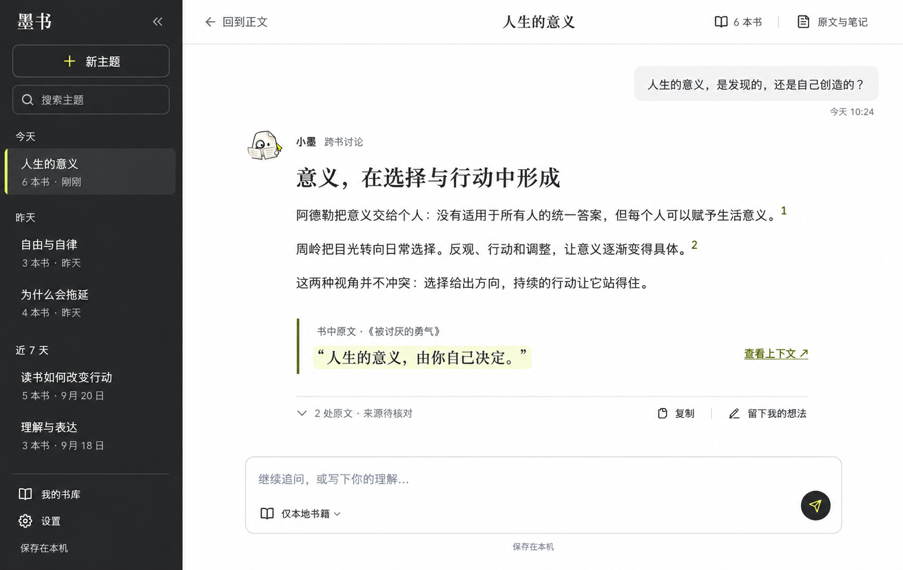
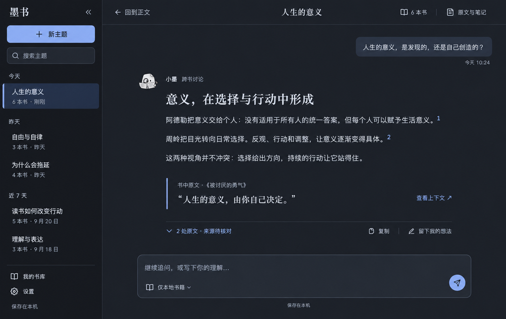

# 墨书配色依据与最终参考

研究与选定日期：2026-09-24。本文整理两轮配色研究的最终结论；未采用的大图、第三方截图副本和生成临时记录未归档。当前实现见[0.1.10 更新说明](../releases/0.1.10.md)。

## 最终决定

保留已选定的两栏布局与宽松阅读空间：左侧历史，右侧连续主题对话。亮色采用“黑白柠黄”，实现名称为**炭灰柠黄**；暗色采用“石墨夜色”，实现名称为**石墨蓝**。不增加常驻第三栏，原文与笔记按需打开。

| 用途 | 炭灰柠黄亮色 | 石墨蓝暗色 |
|---|---|---|
| 主阅读面 | `#FFFFFF` | `#1C2028` |
| 历史栏 | `#252628` | `#14171D` |
| 正文 | `#252629` | `#E6EAF0` |
| 主要强调 | `#D9EB69` | `#A4BDF4` |
| 白底链接／浅色按钮上的文字 | 链接 `#4F5E13` | 按钮文字 `#182233` |

大面积使用中性底色，强调色用于当前主题标记、引文编号、原文入口和发送动作。正文不统一染成强调色，来源状态始终保留文字说明。

两图由内置 Image Gen 生成，保留为设计参考；其中书名、摘录、历史和对话是示例，不是用户数据或已经核验的内容。实际落地截图见[资料索引](../README.md)。

## 官网资料与借鉴边界

研究采用官网公开页面、官方发布的截图与主题说明，未登录或实际操作这些产品。下表记录当时观察，不将墨书建议色号称为其他产品的官方 App 色票。

| 官方来源 | 资料观察 | 墨书采用的原则 |
|---|---|---|
| [Bear 官网](https://bear.app/)、[官方 Mac 截图](https://bear.app/images/home/hero_mac@2x.jpg)、[主题说明](https://bear.app/faq/about-free-and-pro-themes-in-bear/) | 深灰导航与白色编辑区分开，红色用于选中标记、链接等局部位置 | 阅读面与导航分层，强调色只点到关键动作，保持两栏 |
| [Bear 官网 CSS](https://bear.app/screen.css) | 官网采用白底、灰色次级底和红色强调；官网 CSS 不等于 App 色票 | 参考中性底与局部强调的关系，不照搬色号 |
| [iA Writer](https://ia.net/writer)、[官方编辑／预览截图](https://static.ia.net/writer/landing/iAW-alice-writing-formatting-desktop.png) | 黑白灰正文、大留白，工具和颜色存在感较低 | 长文保持中性色，层级通过字号与间距表达 |
| [Craft 官网](https://www.craft.do/)、[官方应用截图](https://www.craft.do/_image/width=1200,quality=85,format=auto/_next/static/media/hero-screenshot-desktop-full.4be7130c.png) | 灰白工具外壳，彩色主要归属于笔记与文档内容 | 将强调限制于选中项、批注和短引文，不给整屏染色 |
| [Ulysses Editor Themes](https://styles.ulysses.app/learn/editor-themes) | 官方将背景、正文、标记强调分开，Strong 可用字重表达；页面标注更新于 2021 年 | 文字身份不只靠颜色，标题与正文仍有字号、字重层级 |

Bear、iA Writer 与 Craft 的公开截图曾用于配色研究；Ulysses 作为规则补充。仓库只保留官方 URL，不重复保存它们的截图文件。

## 可读性要求

亮色方案按不透明建议色值计算：正文／白底约 **15.13:1**，历史栏主文字约 **13.65:1**，次要文字约 **7.81:1**；柠黄与炭灰约 **11.57:1**。这些值描述指定颜色组合，不代表生成图每个像素或所有应用状态都已通过无障碍测试。

柠黄与白底只有约 **1.31:1**，因此白底引用编号和链接使用深橄榄色 `#4F5E13`（约 **7.14:1**）；柠黄用于深底标记或浅色引文底纹。暗色浅蓝按钮使用深色文字，避免浅蓝底上的白字。焦点、当前项和来源状态也应通过边线、字重或文字表达。

冰川蓝、松林绿、银雾梅紫和墨白朱砂属于未采用的历史探索，不作为当前规范。两种选定外观均不宣称健康或医学护眼效果。主题置顶、改名与独立主题札记仍是后续工作，概念图中的示例不扩大已交付范围。
