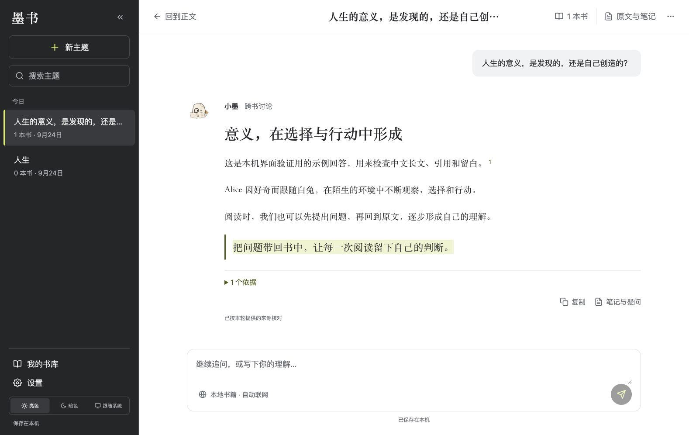
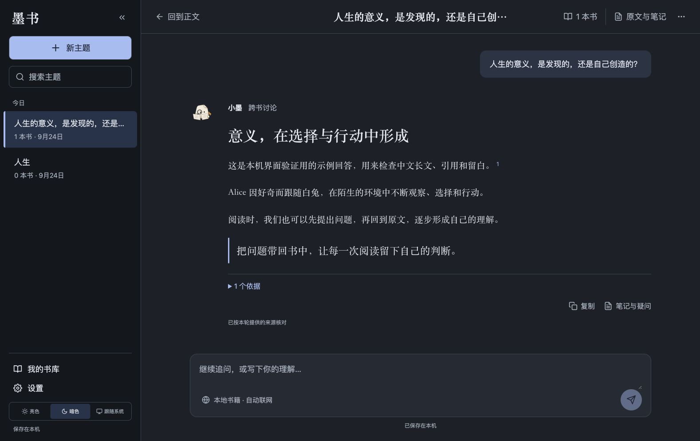
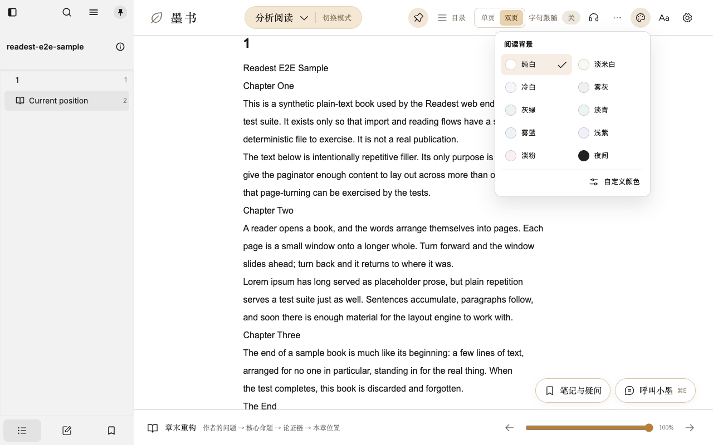

# 墨书界面与阅读配色更新 · 0.1.10

> 0.1.10 的历史交付记录，测试数字与本机构建状态截至 2026-09-24。保留失败与复测边界；日志、安装包、数据清单及用户数据未上传。

日期：2026-09-24。当前状态：桌面 0.1.10 已构建、签名校验、安装并完成原生界面复验。

## 本次结果

主题阅读采用已选中的两栏设计：左侧常驻历史与搜索，右侧保留宽松的连续对话。亮色为炭灰侧栏、纯白正文、少量柠黄；暗色为石墨底、浅蓝强调，可在左下角切换，也可跟随系统。书目、原文和笔记入口放在对话顶部，依据面板按需打开；窄窗口通过历史抽屉切换对话。

正式阅读原先只有 5 个背景，现提供 10 个预设及自定义入口。此前“选纯白却显示米白”源于渲染函数在阅读路由将白色隐式替换为 #FAF7F0；现在删除该替换，菜单色票、外框、正文 iframe 与分页背景使用同一组颜色。

| 阅读背景 | 色值 | 方向 |
|---|---|---|
| 纯白 | #FFFFFF | 无暖色染色 |
| 淡米白 | #FAF8F3 | 比旧米白更淡，降低黄色感 |
| 冷白 | #F5F7FA | 轻微冷灰 |
| 雾灰 | #EFF0F1 | 中性柔灰 |
| 灰绿 | #EDF3ED | 低饱和绿 |
| 淡青 | #EDF5F3 | 轻浅青色 |
| 雾蓝 | #EEF3F8 | 低饱和蓝 |
| 浅紫 | #F3EFF8 | 轻浅紫色 |
| 淡粉 | #FAF0F2 | 轻浅粉色 |
| 夜间 | #222222 | 深灰阅读背景 |

背景选择保存在本机，重新打开保留；旧自定义配色仍兼容。“灰绿”不宣称有医学护眼效果，用户可按环境和喜好选择。

## 对话与笔记

主题历史按今日、昨天、近 7 天及更早分组；搜索支持从旧主题继续阅读。生成、切换和离开操作保持保存保护：当前内容未能落盘时，不替换为另一个主题；切换目标保存成功后再更新当前对话。复制、查看来源和跳回本书笔记使用现有真实功能。

普通对话、主题历史、笔记和阅读记录仍使用现有本地 AppService 文件存储，没有引入云同步或云数据库。桌面目录仍为 `~/Library/Application Support/local.activereader.desktop/Readest`；网页预览使用浏览器本地存储，和桌面书库独立。请求 AI 时仍按现有规则发送完成回答所需的问题与有限上下文，本地持久化不等于模型推理完全离线。

主题置顶、改名和独立主题札记编辑器仍属于后续功能；本次的“笔记与疑问”进入已有本书记录。

## 实际效果

以下为运行中的实际界面，使用本地测试书和明确的模拟回答，非重新生成的概念图。

[主题工作区设计](../design/theme-workspace.md)记录方案与交互约束；[资料索引](../README.md)保留已选参考和测试界面图。原始并排对照验收属于本机验证资料，未上传。

## 验证

- 历史与本地保存专项 20 项通过；阅读配色相关 228 项通过。
- 全量单测 11,374 项通过、1 项快捷键测试超时、19 项跳过。超时文件单独复跑 4/4 通过，未复现功能错误；首次全量退出码保留为 1。
- 完整 TypeScript 与 Biome 检查通过，最后样式与版本配置另行检查通过。
- 18 条端到端用例首轮 17 条通过，1 条失败是旧布局“回答不超过 820px”断言；已改为验证回答处于右侧对话列内、不压住历史栏，并保留原有停止、重试、引用和保存断言。最终受影响的 4 条主题流程全部通过。
- 10 色均检查真实正文 iframe 与 paginator 的颜色；验证刷新保存、390px 菜单、历史抽屉关闭与焦点返回、系统亮暗变化。没有运行时异常；合成 TXT 缺封面造成的资源 404 单独记录。
- 本次只使用本机模拟模型验证交互，没有调用用户的真实模型 Key。测试不代表真实模型内容质量验收。

日志在 界面验证目录（本机验证资料，未上传）。E2E 首轮清理阶段挂起，经安全终止退出码为 130；最终专项正常退出 0，没有把首次运行记录改成全绿。

## 安装与数据核对

- 已安装到 macOS 应用程序目录中的 `Active Reader.app`，版本 0.1.10；仍使用 `local.activereader.desktop`，没有改变数据目录。
- 应用 `codesign --verify --deep --strict` 通过，安装二进制与构建产物一致，DMG 校验通过。
- 替换应用前后、首次启动新版之前核对本地数据，内容一致。随后阅读烟测会正常更新阅读进度、统计和当前主题状态；这一过程不计入安装哈希比较。文件清单不上传。
- 烟测后核对主题文件：既有消息保留，切换前对话已留在历史归档中；不上传用户消息、问答示例或数量明细。
- 原生应用中的书库、笔记与主题历史正常显示；菜单显示 10 个背景选项，纯白保持选中并显示白色正文。未发起新的 AI 请求；私人书目、笔记与阅读位置不上传。
- 旧版应用备份：本机验证资料，未上传。
- 安装记录与哈希（本机验证资料，未上传）；本机安装包（本机验证资料，未上传）。
